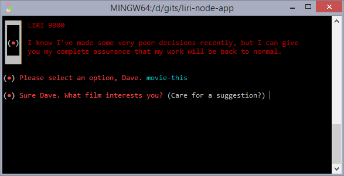

# liri-node-app
"Helpful" CLI assistant

LIRI supports the following commands:
* **`my-tweets`** - Retrieves the last 20 (or as many as are available) tweets from the user specified by the environment variable `TWITTER_USER_HANDLE`. Alternatively, you may specify a twitter handle.
* **`spotify-this-song`** - Retrieves song information for the specified song. Song should be placed in quotes if the title contains spaces. Additional search results can be accessed by specifying a result number, e.g. "`spotify-this-song 'the grudge' 2`".
* **`movie-this`** - Retrieves movie information from OMDB for the specified movie. Movie title should be placed in quotes if the title contains spaces.
* **`do-what-it-says`** - Executes the command specified by 'random.txt' in the LIRI directory (contents of 'random.txt' should be comma-separatd as opposed to space-separated). What happens if 'random.txt' contains the command `do-what-it-says`!?
* **`no command/missing arguments`** - If no command is specified, LIRI will open in interactive mode and prompt the user. Similarly, if arguments are not provided for commands that expect them, the user will be prompted for that information.

### Environment Variables

LIRI expects the following environment variables to be defined:

* `SPOTIFY_ID`
* `SPOTIFY_SECRET`
* `TWITTER_CONSUMER_KEY`
* `TWITTER_CONSUMER_SECRET`
* `TWITTER_ACCESS_TOKEN_KEY`
* `TWITTER_ACCESS_TOKEN_SECRET`
* `TWITTER_USER_HANDLE`
* `OMDB_KEY`